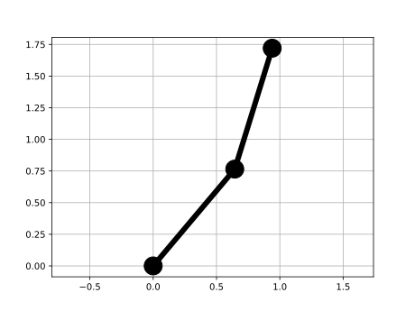

# Double Pendulum System Motion Control

The project:
--
1. Provides functions for singind singular VHS at given point
2. Provides functions for computing singular periodic trajectories
3. Provides functionality transverse coordinates transform

